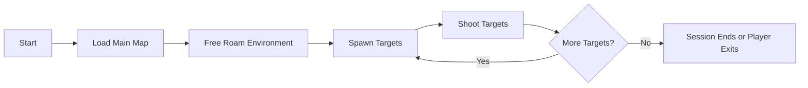
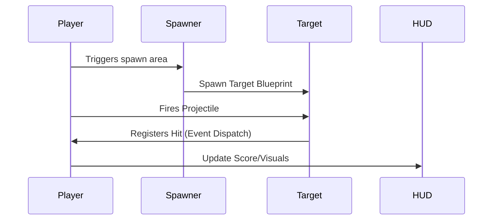
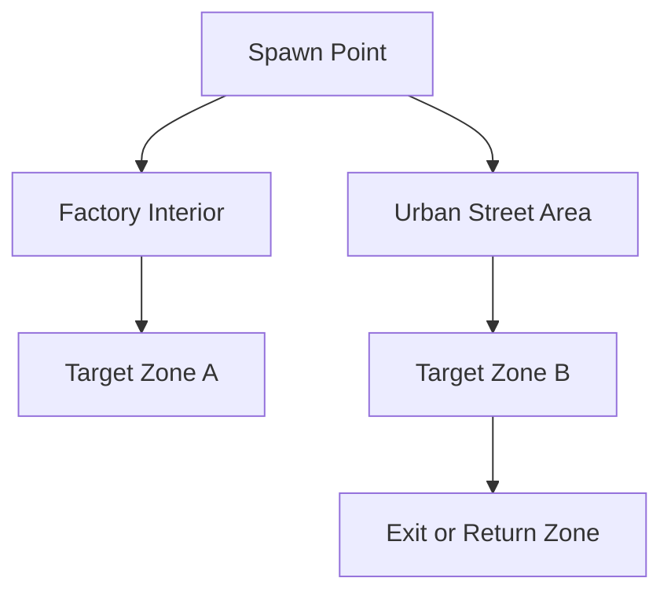

# FPS Shooter - Unreal Engine 5.4.4

This is a first-person shooter game developed in Unreal Engine 5.4.4, set in an abandoned industrial town. The player can freely roam the environment and shoot dynamically spawning targets across the factory and surrounding open areas.

The project utilizes Nanite virtualized geometry for high-detail models and Lumen for real-time global illumination and reflections.

---

## Game Description

The core gameplay is simple and immersive: the player spawns in a large abandoned factory map, equipped with a firearm, and can shoot at periodically spawning targets. The lighting is powered by Lumen for realistic indoor and outdoor ambiance. The level includes both tight industrial corridors and open urban environments, allowing free exploration and shooting practice.

This project demonstrates a standalone gameplay loop within a large environment, combining performance-heavy visual fidelity with interactive elements, suitable for experimentation and further development.

---

## Features

- First-person shooter with responsive controls.
- Dynamic target spawning system.
- Freeroam across a large, open urban-industrial environment.
- Fully lit using Lumen (real-time global illumination and reflections).
- All assets compatible with Nanite virtualized geometry.
- Structured as a single playable map (`mainmap.umap`) within a clean project hierarchy.

---

##  Project Architecture (Logical)

```mermaid
graph TD
    A[Player Controller] --> B[Shooting Mechanism]
    B --> C[Target Actor]
    C --> D[Spawner System]
    A --> E[HUD]
    E --> F[Hit Feedback]
    C --> G[Destruction or Score]
````

> **Note**: Blueprint-based logic with centralized player control and modular spawning.

---

## Folder Structure

```mermaid
graph TD
    A[Content] --> B(mainmap.umap)
    A --> C[Blueprints]
    A --> D[Targets]
    A --> E[UI]
    A --> F[Materials]
    A --> G[Lighting]
```

---

## Gameplay Flow



---

## Feature Overview

| Feature                 | Description                                                     |
| ----------------------- | --------------------------------------------------------------- |
| First-Person Controller | WASD movement with mouse aiming and shooting                    |
| Target Spawning         | Dynamic targets appearing at random or pre-defined intervals    |
| Freeroam                | Full-scale exploration of urban and industrial regions          |
| Nanite Geometry         | Efficient rendering of high-poly assets without LOD overhead    |
| Lumen Lighting          | Real-time global illumination, indirect bounce, and reflections |
| Modular Blueprints      | Separated concerns for easy scalability and gameplay editing    |

---

## Screenshots
<p align="center">
  
  
  
</p>

<p align="center">
  
  
  
</p>

---

## Project Setup

```bash
# Prerequisites
- Unreal Engine 5.4.4
- Windows 10+ with DirectX 12 capable GPU

# Setup Instructions
git clone https://github.com/officiallyutso/FPS-Shooter-Unreal.git
Open the `.uproject` file in UE 5.4.4
Open `Content/mainmap.umap`
Press Play in Editor
```

---

## Target System Blueprint Design



---

## Technology Stack

| Component     | Version          | Purpose                    |
| ------------- | ---------------- | -------------------------- |
| Unreal Engine | 5.4.4            | Core engine                |
| Nanite        | Enabled          | Virtualized mesh rendering |
| Lumen         | Enabled          | Real-time lighting         |
| Blueprints    | Visual Scripting | Gameplay & UI logic        |
| Static Meshes | Quixel Megascans | Environment & props        |

---

## Level Design Map (Abstract)



---

## Future Roadmap

| Feature                  | Status      | Notes                                     |
| ------------------------ | ----------- | ----------------------------------------- |
| Multiplayer Support      | Planned     | Integrate with online subsystems          |
| Scoring System           | In Progress | HUD + Blueprint logic                     |
| Performance Optimization | In Progress | Lightmass alternatives, HLOD setup        |
| Sound & FX Polish        | Planned     | Add spatial audio and hit feedback sounds |
| UI Refinement            | To Do       | Main Menu, Game Over, and Pause states    |

---

## License

This project is licensed under the MIT License. See [`LICENSE`](./LICENSE) for details.

---

## Credits

* Developed by [Utso Sarkar](https://github.com/officiallyutso)
* Assets from Quixel Megascans and Epic Games Marketplace
* Built using Unreal Engine 5.4.4

---

## Repository

GitHub: [github.com/officiallyutso/FPS-Shooter-Unreal](https://github.com/officiallyutso/FPS-Shooter-Unreal)

---
